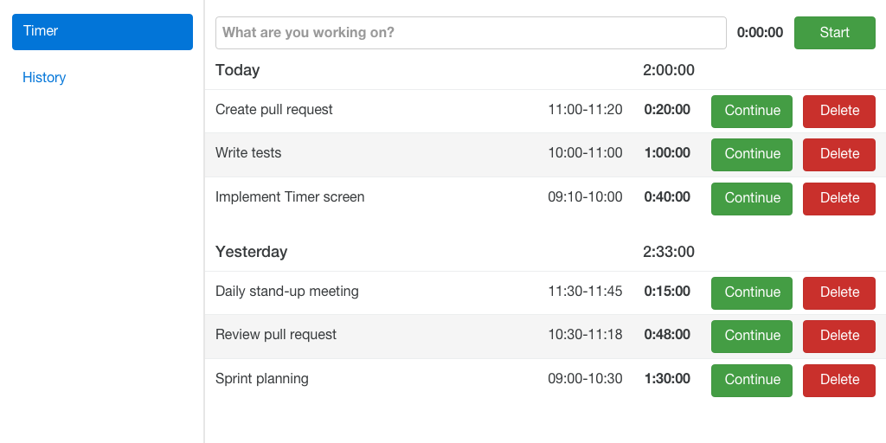
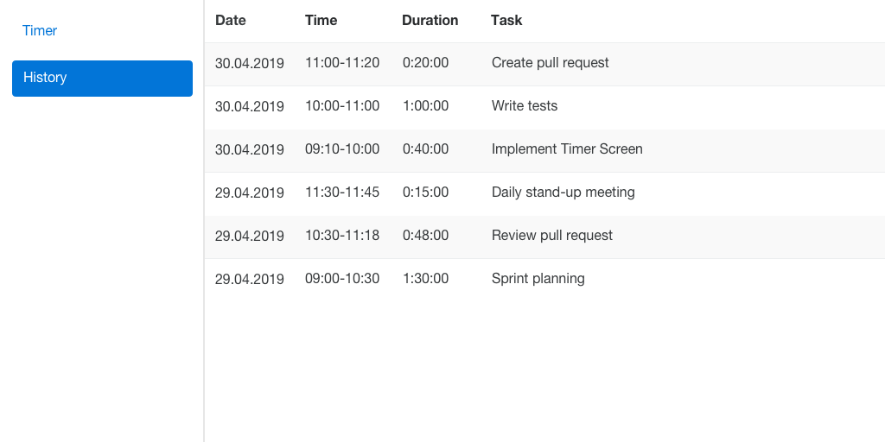

# Fullstack Tech Challenge

This challenge consists of writing a time tracker web app. You are free to decide how to implement it on the frontend site.
The backend should be implemented using the defined stack.

## Getting started

Install yarn (also installs node.js): https://yarnpkg.com/en/docs/install

Install frontend dependencies: `$ yarn install`

We recommend to install backend dependencies into a dedicated python virtual environment with: `$ pip install .`

Run the api: `$ backend `

## Feature Requirements

The time tracker app has two screens: Timer and History. The user can switch between these using a menu.

You are free to alter and improve the UI. The included screen layouts are there only to help explain the app, they are not strictly part of the requirements.

### Timer Screen

As a user I can:

* start tracking my time by entering a task description and clicking the `Start` button, which turns into a `Stop` button.
* stop tracking my time by clicking the `Stop` button.
* view my tasks in descending chronological oder and grouped by days.
* view the description, time interval and time spent for each task.
* view the total time spent for each day.
* continue previous tasks by clicking the respective `Continue` button.
* delete previous tasks by clicking the respective `Delete` button.

### History Screen

As a user I can:

* view all my tasks.
* view the date, time interval, duration and description of each task.

## API

The api should be implemented using Python-Tornado https://www.tornadoweb.org, SQLAlchemy https://www.sqlalchemy.org/
and SQLite https://www.sqlite.org/.
The backend.py module contains a stub which already serves GET requests. Additionally the backend should serve POST,
PUT and DELETE requests. The time entries should be persisted into a SQLite database.
