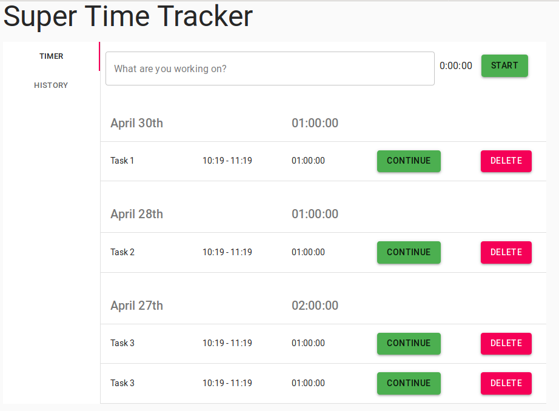

# Super time tracker

A full stack web app challenge.

## Setup for local development

Clone the repo, then install npm and python dependencies

```sh
$ yarn install
$ pip install .
```

Create the database schema and initial sample data

```sh
$ python init_db.py
```

Start the backend & frontend apps

```sh
$ npm run start
```

## Tests

```sh
$ npm run test
```

Then, go to http://localhost:8888

## Preview



## Assumptions

- If you resume a previous task, the original dates will be kept. For example:

  Today is **May 2nd**. `Task XYZ` was created on `April 27th` from `12:00` to `12:30`; you click on **Continue**, and leave it running for 15 minutes. The updated task will still be on `April 27th`, but from `12:00` to `12:45`.
